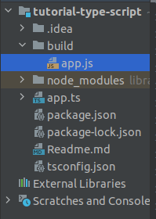
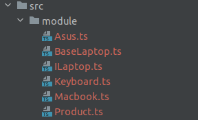

## Install Package Manager
1. Cek versi node js 
    ```command
    $ node -v
    v16.18.1
    ```
2. Cek versi package manager nya
    ```command
    $ npm -v
    8.19.2
    ```
3. Inisialisasi project 
    
    Inisialisasi project java script
    ```command
    $ npm init
    
    This utility will walk you through creating a package.json file.
    It only covers the most common items, and tries to guess sensible defaults.
    
    See `npm help init` for definitive documentation on these fields
    and exactly what they do.
    
    Use `npm install <pkg>` afterwards to install a package and
    save it as a dependency in the package.json file.
    
    Press ^C at any time to quit.
    package name: (tutorial-type-script) 
    version: (1.0.0) 
    description: 
    entry point: (index.js) 
    test command: 
    git repository: 
    keywords: 
    author: 
    license: (ISC) 
    About to write to /home/triyas/data/project/tutorial-type-script/package.json:
    
    {
      "name": "tutorial-type-script",
      "version": "1.0.0",
      "description": "1. Cek versi node js  ```command $ node -v v16.18.1 ``` 2. Cek versi package manager nya ```command $ npm -v 8.19.2 ``` 3. Inisialisasi project",
      "main": "index.js",
      "scripts": {
        "test": "echo \"Error: no test specified\" && exit 1"
      },
      "author": "",
      "license": "ISC"
    }
    
    
    Is this OK? (yes) yes
    
    ```
    
    Install typescript secara development
    ```command
    $ npm i typescript -D
    
    up to date, audited 2 packages in 1s
    
    found 0 vulnerabilities
    
    ```
    Install typescript secara global
    ```command
    npm install typescript --save-dev
    
    npm install -g typescript
    ```
4. Tambahkan di file package .json
   ```json
   "scripts": {
       "tsc": "rm -rf build/ && tsc",
       "ts": "rm -rf build/ && tsc -w",
       "dev": "nodemon ./build/app.js"
     }
   ```
   
   "tsc": "rm -rf build/ && tsc" ==> hapus dulu folder build dan kemudian jalankan tsc,
   "ts": "rm -rf build/ && tsc -w" ==> mode watch
   "dev": "nodemon ./build/index.js" ==> mode development

5. Install nodemon untuk development
   ```command
   $ npm i nodemon -D
   
   added 32 packages, and audited 34 packages in 4s
   
   3 packages are looking for funding
     run `npm fund` for details
   
   found 0 vulnerabilities
   
   ```
6. Generate file tsconfig.json
   ```command
    $ ./node_modules/.bin/tsc --init
   
   Created a new tsconfig.json with:                                                       
                                                                                        TS 
     target: es2016
     module: commonjs
     strict: true
     esModuleInterop: true
     skipLibCheck: true
     forceConsistentCasingInFileNames: true
   
   
   You can learn more at https://aka.ms/tsconfig
   ```
7. Tambahkan konfigurasi di file tsconfig.json
   ```json
   {
      "compilerOptions": {
         "target": "es2016",
         "outDir": "./build",
         "allowJs": true,
         "module": "commonjs",
         "esModuleInterop": true,
         "forceConsistentCasingInFileNames": true,
         "strict": true,
         "skipLibCheck": true
      }
   }
   ```
8. Buatlah file app.ts
   ```ts
   console.log("Hallo")
   ```
   jalankan perintah:
   ```command
   npm run dev
   
   [4:02:23 PM] Starting compilation in watch mode...
   
   [4:02:24 PM] Found 0 errors. Watching for file changes.
   ```
   
   maka akan muncul file app.js di dalam folder build/
   

   kemudian jalankan di terminal lain dengan command:
   ```command
   node ./bulid/app.js
   ```
   atau
   ```command
   nodemon ./bulid/app.js
   ```
   atau
   ```command
   npm run dev
   ```
## Type Data
### String
Kita tambahkan folder src/ dan tambahkan konfigurasi di tsconfig.json
```json
"include": [
"./src"
]
```
sehingga file tsconfig.json menjadi:
```json
{
   "compilerOptions": {
      "target": "es2016",
      "outDir": "./build",
      "allowJs": true,
      "module": "commonjs",
      "esModuleInterop": true,
      "forceConsistentCasingInFileNames": true,
      "strict": true,
      "skipLibCheck": true
   },
   "include": [
       "./src"
   ]
}
```

Coba lihat code berikut ini:
```ts
let name = "Triyas"

name = 20
```

Kode ini akan error ketika dijalankan karena variabel name telah diinisiasi dengan type data string.
Seharusnya sperti ini:
```ts
let name = "Triyas"

name = "20"
```

atau 

```ts
let name: string = "Triyas"

name = "20"
```

### Number dan Boolean
```ts
// number
let umur:number =  20
umur =  13
console.log(umur)


// boolean
let isMarried: boolean;
isMarried = true
isMarried = false
```


### Any
Any adalah type data yang bisa diisi dengan type data lain, layaknya java script biasa.
```ts
// any
let heroes: any = "Iron man"
heroes = 20
heroes = []
heroes = "String"
heroes = {}
heroes = true || false || "String"
```


### Array

```ts
// array number
let array = [1,2,3]
array = [12,2,21]

let arrayNumber: number[]

// array string
let arrayString: string[]

// array any
let arrayAny: any[]
```


### Tuples
Tuples adalah sebuah array yang isinya bisa berbagai macam type data tetapi nilai atau itemnya terbatas.

```ts
// tuples
let biodata:[string, number, boolean]
biodata = ["Surabaya", 123, true]
```

jika ```biodata``` diisikan lebih dari tiga atau type datanya tidak sesuai, maka akan terjadi error.


### Enum
Enum adalah Sebuah data yang menyimpan sekumpulan data konstan.
```ts
// enum

// numeric enum
enum Month{
    JAN,
    FEB,
    MAR,
    APRIL,
    MAY
}

console.log(Month)
console.log(Month.JAN)

enum Month2{
    JAN=100,
    FEB,
    MAR,
    APRIL,
    MAY
}

console.log(Month2)
console.log(Month2.MAR)

```

### Function
```ts
// type data function mengembalikan string

function getName(): string{
    return "Hello, my name is Triyas"
}

console.log(getName())
```


Function yang telah dideklarasikan (misal string) harus mengembalikan data, jika tidak mengembalikan data, maka kan terjadi error.
Contoh:
```ts
// type data function

function getName(): string{
    // return "Hello, my name is Triyas"
}

console.log(getName())
```

function ini akan terjadi error karena tidak mengembalikan nilai string. Return juga harus sesuai dengan deklarasi variabel nya.

```ts
// type data function mengembalikan number

function getNumber(): number{
    return 1234
}

console.log(getNumber())
```

```ts
// type data function tidak mengembalikan nilai

function printName(): void{
   console.log("print name")
}
```

### Argument
```ts
function multiply(val1: number, val2:number): number{
    return val1*val2
}

const result = multiply(20,100)
console.log(result)
```

### Function sebagai type data

```ts
// Function sebagai type data
type Age = number;
let age: Age = 12;
```

```ts
type Tambah = (val1: number, val2: number)=> number
const  Add: Tambah = (val1:number, val2:number):number =>{
    return val1+val2
}
```

Note: 
- Pertama kita membuat type ```Tambah``` dengan value 1 dan 2 number dan mengembalikan nilai number. 
- Ketika kita membuat sebuah function ```Add```, value 1 dan 2 harus number dan mengembalikan number juga.


### Object
Object hanya dapat diisi sesuai dengan yang telah diinisiasi saja.
```ts
// Object

let user= {
    name: "Triyas",
    age: 25
}

user = {
    name: "Yogyakarta",
    age: 20
}

// Atau
type User = {
    name: string,
    age: number
}

let usr: User = {
    name: "Triyas",
    age: 232
}

usr = {
    name:"Yogyakarta",
    age: 21
}
```

### Union type
Pada union type, kita dapat menentukan tipe data yang lebih dari satu.
Dalam sebuah kasus, misal
```
6281234567 ==> ini type data number
```
atau

```
"081234567" ==> ini type data string, jika type data number nilai 0 akan dihapus
```

Kita bisa isikan data number atau string
```ts
let phoneNumber: number|string

phoneNumber = 6281009948848
phoneNumber = "0871263672727"

```
### Function Default Parameter
```ts
const fullname = (first: string, last: string = "Saputra"): string =>{
    return first+" "+last
}

console.log(fullname("Triyas"))
```

### Optional Parameter
```ts
const getNama = (val1: string, val2?: string): string =>{
    return val1+" "+val2
}

console.log(getNama("Triyas"))
```

### Class Dasar
Dalam java script tidak ada class tapi prototype, jadi nanti ketika di-compile ke java scr
```ts
export class User{
    public name: string

    constructor(name: string) {
        this.name = name
    }
}

export class Product{
    constructor(public name: string) {}
}

let  user = new User("triyas")
let product = new Product("Sabun")
console.log(user.name, product.name)
```

### Inheritance / class turunan

```ts
export class User{
    public name: string

    constructor(name: string, public age: number) {
        this.name = name
    }
    
    setName(val: string):void{
        this.name = val
    }
    
    getName = (): string =>{
        return this.name
    }
}

class  Admin extends User{
    read: boolean = true
    write: boolean = true

    getRole():{read: boolean, write:boolean}{
        return {
            read: this.read,
            write: this.write
        }
    }
}


let admin = new Admin("admin", 25)
console.log(
        admin.name, 
        admin.getRole(), 
        admin.age
)
```

Dari code di atas, Object Admin akan mewarisi semua atribut ataupun metode dari object User.

### Super Constructor

```ts
export class User{
    public name: string

    constructor(name: string, public age: number) {
        this.name = name
    }

    setName(val: string):void{
        this.name = val
    }

    getName = (): string =>{
        return this.name
    }
}

class  Admin extends User{
    read: boolean = true
    write: boolean = true
    phone: string

    constructor(phone:string, name: string, age: number) {
        super(name, age);
        this.phone = phone
    }
    getRole():{read: boolean, write:boolean}{
        return {
            read: this.read,
            write: this.write
        }
    }
}


let admin = new Admin("0812343333", "admin", 25, )
console.log(
        admin.name, 
        admin.getRole(), 
        admin.age, 
        admin.phone()
)
```
Kita menambahkan atribut phone

### Setter dan Getter
Kita coba tambahkan property email pada class Admin:

```ts
export class User{
    public name: string

    constructor(name: string, public age: number) {
        this.name = name
    }

    setName(val: string):void{
        this.name = val
    }

    getName = (): string =>{
        return this.name
    }
}

class  Admin extends User{
    read: boolean = true
    write: boolean = true
    phone: string
    private _email:string = ""

    constructor(phone:string, name: string, age: number) {
        super(name, age);
        this.phone = phone
    }
    getRole():{read: boolean, write:boolean}{
        return {
            read: this.read,
            write: this.write
        }
    }

   set email(value:string){
      // add validator
      if(value.length < 5){
         this._email = "email salah"
      } else {
         this._email = value
      }

   }

   get email(): string{
      return this._email
   }
}

let admin = new Admin("0812343333", "admin", 25, )
admin.email = "triyas@gmail.com"
console.log(admin.email)
```


### Static Property dan Static Method
Sebuah property atau Method yang bisa langsung dipanggil tanpa harus melakukan instansiasi sebuah object.
Mari kita tambahkan property roleName dan method getRoleName pada class Admin:
```ts
export class User{
    public name: string

    constructor(name: string, public age: number) {
        this.name = name
    }

    setName(val: string):void{
        this.name = val
    }

    getName = (): string =>{
        return this.name
    }
}

class  Admin extends User{
    read: boolean = true
    write: boolean = true
    phone: string
    private _email:string = ""
    static roleName = "Admin"
    static getRoleName(){
        return "hey ..."
    }

    constructor(phone:string, name: string, age: number) {
        super(name, age);
        this.phone = phone
    }
    getRole():{read: boolean, write:boolean}{
        return {
            read: this.read,
            write: this.write
        }
    }

   set email(value:string){
      // add validator
      if(value.length < 5){
         this._email = "email salah"
      } else {
         this._email = value
      }

   }

   get email(): string{
      return this._email
   }
}

console.log(`static property${Admin.roleName}`,`static method: ${Admin.getRoleName()}`)
```

### Abstract Class
Sebuah class yang tidak bisa diinstansiasi langsung dari luar class itu sendiri, melainkan harus mengekstensi sebuah class child nya.
```ts
abstract class Vechile{
   abstract wheels: number

   start():void{
      console.log("Brummm...")
   }
}

class Car extends Vechile{
   wheels: number = 4
}

let car = new Car();
console.log(
        car.wheels
)
car.start()
```


### Interface
```ts
interface Laptop{
    name:string,
    on() : void
    off(): void
}

class Asus implements Laptop{
    name: string;
    isGaming: boolean
    constructor(name:string, isGaming:boolean) {
        this.name = name
        this.isGaming = isGaming
    }
    off(): void {
        console.log("Mati")
    }

    on(): void {
        console.log("Nyala")
    }
}

class MacBook implements Laptop{
    name: string;
    keyBoardLight: boolean
    constructor(name: string, keyBoardLight:boolean) {
        this.name = name
        this.keyBoardLight = keyBoardLight
    }
    off(): void {
        console.log("Mati")
    }

    on(): void {
        console.log("Nyala")
    }
}

let asus = new Asus('Asus', true)
console.log(asus.on())
console.log(asus.off())

let mb = new MacBook('Asus', true)
console.log(mb.on())
console.log(mb.off())

```


### Generic

```ts
// contoh function generic (tetapi masih ada kekurangan)
function getData(value:any){
    return value
}

console.log(getData("test").length)
console.log(getData(1234).length)

// generic function
function myData<T>(value: T){
    return value
}

console.log(myData("test").length)
console.log(myData(1234))

// generic Arrow Function Typescript biasa
const arrowFunction = <T>(value:T) =>{

}
// generic Arrow Function Typescript jst
const arrow1 = <T extends unknown>(value:T) =>{
}
const arrow2 = <T extends {}>(value:T) =>{
}

const arrow3 = <T,>(value:T) =>{
}
```

### Class Generic 
```ts
class List<T>{
    private data: T[]
    constructor(...elements: T[]) {
        this.data = elements
    }

    add(element:T):void{
        this.data.push(element)
    }

    addMultiple(...elements: T[]):void{
        this.data.push(...elements)
    }

    getAll():T[]{
        return this.data
    }
}


let numbers = new List<number>(1,2,3)
numbers.add(4)
numbers.addMultiple(5,6,7)
console.log(numbers.getAll())


let random =  new List<number|string>(1,"a","b", 2)
random.add("c")
random.add("3")
random.addMultiple(4,5,"d")

console.log(random.getAll())
```

### Contoh Kasus

Silakan buat file ini:



Isinya bisa dilihat di repo ini.


Reference:
- https://www.youtube.com/watch?v=Hb3Xxs4vDj4
